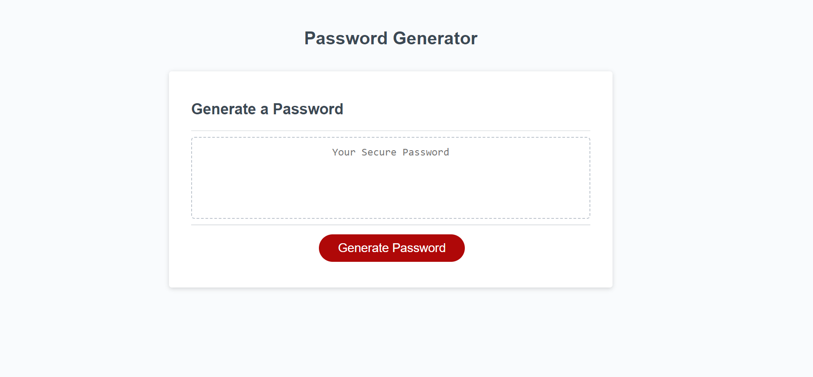

# password-generator

## Description

This is a website that, in response to user criteria, will generate a secure password. Valid characters include uppercase and lowercase letters, numbers, and special characters. The website uses commands such as prompt() and confirm() to take into account the user criteria, which include the length of the password and which types of characters to include. The prompts are set to loop if an invalid answer is given, such as having no characters or having a length outside of the valid range.

## Deployed Page
A preview of the deployed page is shown below.

## Installation
N/A

## Usage
Access the deployed site at (placeholder). Click on the button to begin generating the password, then answer the prompts that will appear near the top of the page. After the password has generated, highlight it and copy it to the clipboard to save it to a different location. Reload the page to clear the password box.

## Credits
N/A
